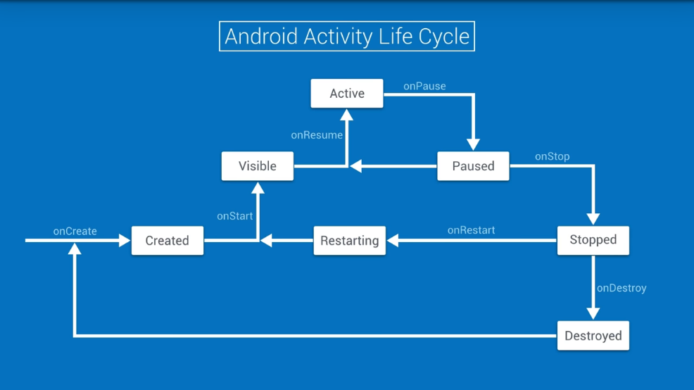
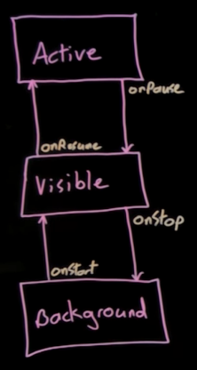
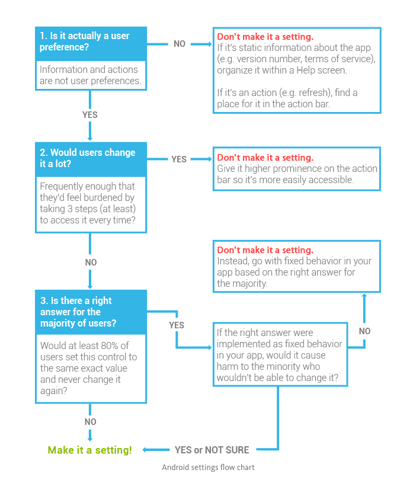
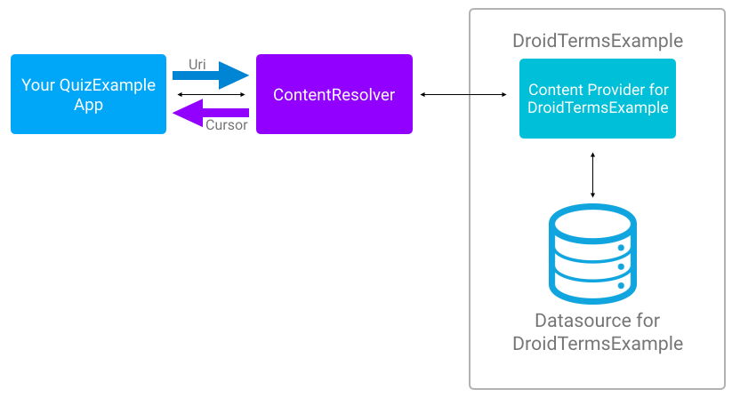

# Google Developers Challenge Scholarship

##### Table of Contents  
[Stage 1](#stage1)  
[Stage 2](#stage2)  
[Stage 3](#stage3)  
[Stage 4](#stage4)  
[Stage 5](#stage5)  
[Stage 6](#stage6)  
[Stage 7](#stage7)  
[Stage 8](#stage8)  


<a name="stage1"/>

## Stage 1 [06-11-2017]

*So why not just set the minSDK to 1 and support everyone? Generally, you’ll want to target as many users as you can, but there's a cost associated with supporting older versions - things like creating different execution paths around deprecated or updated APIs, or presenting a different UX to devices with different features. You need to balance the opportunity of expanding your audience, with the cost of supporting those users.*

**Also remember that each release introduced new APIs and hardware support, so it may not make sense to make your app available to devices that don’t support your minimum feature set. Here are some examples of hardware support and features, tied to releases.**

1. Home screen widgets (Cupcake)
2. Multiple finger tracking (Froyo)
3. Tablet (Honeycomb)
4. Android Beam (Jellybean)
5. Android TV, Auto, Wear (Lollipop)
6. Pro Audio (Marshmallow)

**Setting targetSDK**
*By comparison, the targetSDK is NOT a high pass filter -- it’s used only to declare which platform version you've tested your app on. An app targeted to a certain API or Android version will continue to be forward compatible on future releases -- the platform uses the target SDK values in case a future release makes a significant change to expected behavior, ensuring your app doesn’t break when a user’s phone gets upgraded.  
Android Studio by-default targets the latest release. If you’re developing a new app, there’s really no reason to target anything but the latest Android version, and once your app has been released, make it a point to update your target SDK and test as soon as possible when new platform releases roll out, so your app can take advantage of every new platform optimization and improvement.**

>Your app runs within its own instance of the run time using the classes and services provided here in the application framework.

**The first thing that happens when you hit RUN is your code gets compiled into byte code that can be run in the run time on the device. In Android Studio is done using Gradle, a build tool kit manages dependencies and allows you to define custom build logic. For now, not that we start with your project, whic Gradle builds and then packages the byte code along with your applications resources, externalized images, UI, XML, into an Android Application Package file. An APK whic is especially formatted ZIP file. Once you got a APK ready to go Android Studio signs it through JAR Signer and then pushes it to the device using the Androdi Debug Bridge or ADB

>On Windows and Mac, the x86 emulator relies on a special kernel driver called HAXM for hardware virtualization

>A gradle task represents a single, atomic piece of work for a build. To see a list of tasks, you can open the tasks window in Android Studio by clicking on the gradle button on the far right. Clicking on the name of the task runs that task.

*Run gradle build task from the command line*
`./gradlew tasks`

*For example, to start your android app from the command line, you could type:*

`adb shell am start -n com.package.name/com.package.name.ActivityName`

**What is an Android Application**
*A collection of components that work with each other, and with the Android Framework. There are four types of components that make up apps*
1. Activity
2. Services
3. Broadcast Receiver
4. Content Providers

*Android knows about each of these components because they are registered in Android Manifest*  
*The Android Manifest is used to register components with the Android framework.*

**Activity**  
*Single focused thing that the user can do.*  
*Activities are responsible for creating the window that your application uses to draw and receive events from the system such as touch event from the system*

**Type of Views in Android**  
1. UI Components
  1. TextView
  2. EditText
  3. ImageView
  4. Button
  5. Chronometer

2. Container View
  1. LinearLayout
  2. RelativeLayout
  3. Framework
  4. ScrollView
  5. ConstraintLayout

**A word about id**
`@+id/tv_toy_names`
*The @ sign tells the tools not to treat the stuff inside the quotes as a string literal. And to instead, look for the contents inside of the Android resources. While the plus sign tells the tool to create the id if it doesn't yet exist. The id preceding the slash, lets the tools know that we're creating an id rather than a reference to something like a style, string or image drawable*

*Well the R class is autogenerated by the Android tool chain. But because Java doesn't allow for slashes in variable names the tools replace the slash after the id with a period*

#### Stage 1 Completed!

<a name="stage2"/>

## Stage 2 [7-11-2017]

**Message logging display levels**  
1. Error
2. Warn
3. INFO
4. Debug
5. Verbose
> In term of increasing verboseness in severity
>Error, Warn and Info level messages are always preserved in release versions
> During development you can also use DEBUG and VERBOSE log messages

**Android has another very special logging level that is more severe than ERROR**  
*It is called WTF for What a Terrible Failure. The WTF level is for errors that should never, ever, ever happen and most developers should never ever, ever use it. On a debug build of a device, a WTF error may force the device to halt and output a debug report. Because the behaviour of WTF isn't clearly defined, it might be best to only use the knowledge of this sepecial log level to impress your friends ;)*

>R is a static class that is generated by aapt (Android Asset Packing Tool) for us to reference resources in Java Code

*We also allow applications to specify menu items as actions. If there's enough horizontal space, those actions appear on the action bar as buttons. To do this in our menu XML, we add the show as action attribute. We're doing this in the app namespace because we're using AppCompat to make our app compatible with API Level 10 Gingerbread devices.*

**Toast**  
*Provides simple feedback about an operation in a small popup*

>use the showAsAction XML attribute. You can actually add a button to the Toolbar layout, but that's making a custom toolbar rather than making a menu item show up as a button.

*We can take advantage of the Android URI framework class. It allows us to create a well-formed URI without having to worry about the particular of URI components. For example, adding ampersands between query parameters and encoding invalid character with a percent followed by the character code*

**UTF-8**  
*Is used by JSON and JavaScript*  
**UTF-16**  
*Is the format used by android*

>While declaring a permission is required for using the camera, directly dialing the phone, and directly accessing the contact database - you can do each of these things by using a system app as an intermediator. Because the camera app, dialer, and contacts app will be used to provide the data you request - users have the chance to cancel the action you initiated, giving them runtime ability to refuse your app access.

**Your app can only access the user’s location if it explicitly declares a uses-permission.**


>NetworkOnMainThreadException only occur if your app is running in device over Gingerbread version of android if the version is Gingerbread or lower it would work fine but its a bad practice to do network stuff on Main Thread

*To run at an ideal 60 frames per second We need to make sure that all the computations between draws takes  less than 17 milliseconds*  

>After five second of ignoring user input, Android would actually prompt the user to close your app.

**AsyncTask**  
*Allows you to run a task on a background thread, while publishing results to the UI thread*  

>AsyncTask is a generic class. Meaning it takes parameterized types in its constructor. Each one of these generic parameters is to find as a Java variable argument with the three dots, which means that it is technically passed as an array in Java world.

**The three types used by an AsyncTask are the following**  
1. Params -> Parameter type sent to the task upon execution
2. Progress -> Type published to update progress dueing the background computation
3. Result -> The type of the result of the background computation

**There is a list of menthods and which runs on UI thread of background thread, got it varun!!!**  
1. execute() -> UI thread
2. onPreExecute() -> UI thread
3. doInBackground() -> Background thread
5. publishProgress() -> Background thread (called from inside the doInBackground())
6. onProgressUpdate() -> UI thread
7. onPostExecute() -> UI thread

**JSON**  
*Primary method for data exchange on the web because it's format is syntactically identical to the code for creating JavaScript objects, this means that JavaScript programs can use standard JavaScript functions to read JSON data since it's essentially native JavaScript*

**Why JSON**  
1. Human readable
2. More compact
3. Easier to write
4. Allows for declaration of arrays

#### Stage 2 Completed!

<a name="stage3"/>

## Stage 3 [08-11-2017]

*The first thing to note is that almost every part of recycler view is completely modular. The RecyclerView has an Adapter that is used to provide the RecyclerView with new views when needed. This Adapter is also used to bind data from some Data Source to the views. The adapter sends the views to a RecyclerView in an object called a ViewHolder. The ViewHolder contains a reference to the root view object for the item. And you're expected to use it to cache the view objects represented in the layout, to make it less costly to update the views with new data. This way findViewById gets called only for each data view whenever that new item is created and not each time you want to populate the views in the item with data. The LayoutManager then tells the RecyclerView how to lay out all those views. It could be a vertically scrolling list like we use in SunShine, or Horizontally scrolling lists, or even a staggered list or a grid. You get some awesome animations for item insertion and removal for free. Because it's based on a data source, it's easy for app using RecyclerView to allow for filtering a list items*  

*It's important that you use the view holder to cache the view objects that you're going to be populating with data or images. When the RecyclerView is first being populated. You call findViewById for each view that will be showing data from the adapter. This search can be expensive, especially if you have a hierarchy of views in your list item. So it's best to do it once and cache those views in a view holder. This way you can access those views later without having to look them up repeatedly. If you don't use a view holder calling findViewById for each view can get out of hand pretty quickly*  

**Let’s say that each item in your RecyclerView list contains four individual data views, and you don't cache these views in a ViewHolder. If eight items fit on screen, approximately how many extra findViewById() calls will be made if you scroll through 30 items? In addition to the eight items that fit on screen, assume that two extra items are needed for smooth scrolling.**  

**Note**:-  
*We use SP and DP when we've reffered to dimensions in Android layouts. These are both not acctual pixel sizes but are automatically scaled to be the same approximately physical size, regardless of the density of the pixels on the screen. The first Android phones were 160 dpi and i dp would actually equal to 1 pixel on these devices. The conversion of dp units to screen pixels is simple, px = dp * (dpi/160). Many modern devices have 480dpi or more. Sp work like DP but are also scaled based upon user preferences, typically the text size preference.*  

>One of the most important things a ViewHolder does is cace these references to the views that will be modified in the adapter since findViewById can get expensive

*The adapter is called by the RecyclerView to create new items in the form of ViewHolders, like the one we just created. It also populates, or binds, these items with data. And return information about the data, such as how many items there are in given data source. This data could come from an ArrayList, the JSON result of a network request, or any other data source you can model. The Adapter requires us to override three functions. The first is onCreateViewHolder, which is called when the RecyclerView instantiaes a new ViewHolder instance. The second is onBindViewHolder, which is called when RecyclerView wants to populate the view with data from our model, So that the user can see it, effectively binding it to the data source. And third is getIteCount, which returns the number of item in our data source.*  

**What is the Adapter responsible for?**  
1. Creating a ViewHolder for each RecyclerView item.  
2. Returning the numbers of items in the data source  
3. Binding data from the data source to each item.  
4. Inflating each item view that will be displayed.  

>The adapter does create ViewHolder objects and inflates item views in its onCreateViewHolder function, it also returns the number of items in the data source, and binds data from the data source to each item (even if we pass the responsibility to the ViewHolder). It doesn't cache views associated with each item (that's the job of the ViewHolder class) nor does it recycle them; that’s what our RecyclerView does.

>Whereas a ViewHolder determines how an individual entry is displayed, the LayoutManager determines how the collection of items is displayed. LayoutManager is a key part of the way recycling works in RecyclerView since it determines when to recycler items views that are no longer visible to the user.

**Note:-**  
*Assigning `setHasFixedSize(true)` to true allows RecyclerView to do some optimization on our UI, namely, allowing it to avoid invalidating the whole layout when adapter contents change*  

**Android comes with three LayoutManager**  
1. LinearLayoutManager  
2. GridLayoutManager  
3. StaggeredGridLayoutManager  

#### Stage 3 Completed!

<a name="stage4"/>

## Stage 4 [09-11-2017]

**How do we start one activity from another?**  
*Well, instead of having an activity call each other directly, Android facilitates communiction using messaging objects called Intents. Intents let an app request that an action take place. That can be anything from starting a new activity to picking or displaying a photo from your phone gallery, or make a phone call*  

>In an android application, activities can be started and stopped at any time, So the context gives us a way of doing certain things that might effect an app as a whole or might outlive the lifetime of a single activity

>Most implicit intents include two things, an action and a data. The action says what you're trying to do and the data is what you're passing onto the action

>query parameter limit from 8000 to 190,000 characters, depending on the browser used.

**A URI is like an address that points to the data you're plannning to pass through to the intended action**  

>A URI or Uniform Resource Identifier is a string of characters that identifies a resource. One of the ways you use URIs every day is when you navigate to web addresses like https://www.udacity.com The formal name of a web address is a URL or Uniform Resource Locator. A URL is a URI that identifies a web or network resource. But as we saw in the Android documentation for opening a map, a URI like geo can describe a physical location.

`scheme:[//[user:password@host[:port]][/]path[?query][#fragment]`

*Here's the full form of a URI, |^| with all the optional parts shown in brackets. It begins with a scheme. The scheme describe what type of resource we're pointing to. Popular schemes on the web are HTTP  and HTTPS, mailto, FTP, file, and geo, but there are many more. Depending on the particular scheme, it might be followed by two slashes and an authority part. The authority indicates an optional username and password to log in, a host name which could be a domain name or an IP address, and an optional port. For HTTP request, unless otherwise stated, browsers assume port 80.*

>mailto is one of the schemes that doesn't require the authority part and can worrk with just a path

>It's important to note that if there is a query paramters for our street address or business, the lat long  path must be 0,0

`geo:0,0?q=Antwerp,Belgium&z=10`

>Here is a |^| geo URI that shows the city of Antwerp in Belgium with a zoom factor of 10

*When you want to share data there's a lot more you need to think about, than if you're just starting a new activity. Depending on where you want to send the data you have to think about what type of data it is, the number of files and other things. To save you from all those concerns Android had a special helper class called ShareCompat. ShareCompat and it's inner class IntentBuilder abstract away all of these decision so you can chain together the bits that you need and ignore those that you don't*

>Every type of content that can be transmitted on the internet has two part identifier and that's called media type. You might see the more archaic name sometimes, MIME type, which stands for Multipurpose Internet Mail Extensions. When they were initially defined for RFC 2046, media types allowed you to have multi-part emails with different types of attachments. Media types are a reason why someone can send a single email with images, video and other file types as attachments, and your email client knows exactly how to interpret each file. A media type string consists of a type, a subtype, and optional paramters.*

**Media Type String**
`top-level name / subtype name [; paramters]`

**Here's an example media type that describes most of the web pages on the internet**
`text/html; charset=UTF-8`

>The type of data is text specially HTML text, and it has a character set encoding of UTF-8

**More Examples**  
1. text/plain
2. text/rtf
3. image/png
4. video/mp4

>Whenever you want ot share between apps, you'll have to specify it's media type so that Android can determine how and if it can fulfill the request

*Opening a web link would be an implicit intent because you aren’t specifying a specific browser to use, the user gets to choose.

Opening an activity uses an explicit intent because you know exactly where to go.

Sharing content to Twitter is a bit of a curveball. We’ve taught you the best way to do it using an implicit intent. It is possible as an explicit intent but not recommended.*

#### Stage 4 Completed!

<a name="stage5"/>

## Stage 5 [10-11-2017]

#### Activity Lifecycle Diagram



*The **Active** Lifecycle is when your activity is in the foreground and has focus. Here it's actively receiving input from user events. And no other activities are obscuring it. **onPause** is call, and the **active** lifetime ends as soon as your activity is partially obscured, like when you have another activity trying to fulfill an implicit intent and user needs to make a selection. So to make efficient use of limited resources, you'll want to use these signals to adjust your app's resource burden. So most updates to your UI can be paused when this life time ends, which is announced by onPause. But as you see, the app is still visible So, you shouldn't pause any processes that are drawing your UI. The visible lifetime on the other hand, continues whenever the app is all visible and ends as soon as it's completely obscured by another app. At that point our app is moved to the background. So when you see onStop you know the user can't see your app at all. So, while onCreate and onDestroy will be called at most once each time your app is run. These handler (See the picture below) are likely to be called many times while the app is running.*  



*Rotating the device causes the Activity to be destroyed and recreated, so our lifecycle starts at onPause and ends at onResume. Note that we don't see onRestart, which only happens if the activity is stopped (but not destroyed) and then restarted.*

>OnSaveInstanceState takes a bundle as its parameter. This bundle is a key value storage mechanism that we use to store the data we want to be saved. Now it can't quite store any data. Bundles need to passed between processes or serialized to a file. So they support a limited set of types. That being said, you can add complex types to a bundle by having them implement the parcelable interface. The parcelable effectively contains the instructions for how to output an Object to a stream of data, and then recreate the object from that stream.

**onSaveInstanceState is called after the onPause but before onStop, onDestroy**

>onPause and onStop are singnals that our app may be killed imminently. So we need to clean up any resources that need an orderly tear down such as closing an open connections or sockets.

*When we destroy and recreate an activity the application continues to run. That means that all of the threads that were running continue to merrily process away. In the case of our GitHub query app it delivers the result of the query to a zombie activity that has gone away and the activity is left empty. But it's even worse in the current version of sunshine. In sunshine, we create our AsyncTask in the onCreate method of our activity. It starts a thread which begins a background task. If we rotate the device or do something else which causes the activity to be restarted, the new activity will create another async task to do the background operation. There will be extra network usage as both threads run in parallel and it will take a longer time for the user to see the result of the load. Even worse because those background thread ultimately deliver their result to a callback that's part of the activity, those async tasks actually keep all of those old zombie activities around as long as the threads are running casuing extra memory pressure. Enter loaders to solve this problem. They've been part of Android since Hineycomb and were added to the support library so they are available on any useful Android release. Loaders provide a framework to perform asynchronous loading of data. They're registered by ID, with a component called the LoaderManager, which allows them to live beyond the life cycle of the activity they are associated with, preventing duplicate loads from happening in parallel. If we want to load data on a background thread, we can use an implementation of a loader pattern called AsyncTaskLoader. The AsyncTaskLoader implements the same functionality as AsyncTask, but because its a loader its lifecycle is different. With an AsyncTaskLoader, once we rotate the device, the loader manager will make sure that the running loader is connected to the AsyncTaskLoader equivalent of onPostExecute the onLoadFinished function. The loader thread keeps running in the loadInBackground function. And once it finishes, the activity gets notified through onLoadFinished.*

>AsyncTaskLoader is a better choice for Activity-bound thread management, because it handles lifecycle changes correctly, delivering the result to the current active activity, preventing duplication of background threads, and helping to eliminate duplication of zombie activities.

*Creating loader is actually pretty simple. We start off by creating an integer constant for a loader ID. Then, we implement the loader call backs. Finally, we initialize the loader with the loaderManager*

>restartLoader will create loader if it doesn't yet exist

>Loaders are tied to the application lifecycle. They automatically handle changes in configuration, such as rotation. They are designed to reload if the user navigates away from the activity and then return. We can avoid that extra load if we don't find it desirable by caching and redelivering our existing result. 


**If you want to cache your result and put it back if you don't need to ftech the data again save the result and override deliverResult().**

#### Stage 5 Completed!

<a name="stage6"/>

## Stage 6 [11-11-2017]  

**Data Persistence**  

| Persistence Option | Type of data saved | Length of time saved |
| --- |--- | --- |--- |
| onSaveInstanceState | key/value(complex value by using parcelable interface) | While app is open |
| SharedPreferences | key/value(primitive values) | Between app and phone restarts |
| SQLite Database | Organized, more complicated text/numeric/boolean data | Between app and phone restarts |
| Internal/External storage | Multimedia or larger data | Between app and phone restarts |
| Server (ex. Firebase) | Data that multiple phones will access | Between app and phone restarts, deleting the app, using a different phone, etc |

**PreferenceFragment**  
*Because SharedPreferences are usually used for app settings, they work hand-in-hand with another part of the Android Framework. Which was meant for creating user interface for settings activities. This framework class is called PreferenceFragment.*  

**Fragment**  
*A class that represents a modular and reusable piece of an Activity*  

>The PrefernceFragment subclass is specially built for displaying prefenrences  

*There's also a class called PreferenceActivity which I don't want you to confuse things with. Since Honeycomb it's been deprecated in favor of the more flexible fragment version.*  

*PreferenceFragments populate themselves with preferences defined in XML. This is much like how our activity layouts are also created in XML. The XML is used to generate UI widgets in the fragment. When the user changes these values in the widgets, this automagically updates associated key value pairs in the SharedPreferences file.Then when you need to actually know the value of the preference, you can then read from the SharedPreferences file in your app*  

`android:launchMode="singleTop"`
*This |^| this make sure that when you navigate back from SettingsActivity it doesn't remake the VisualizerActivity  

1. Astro   
2. Bender  

**Any preference XML's outer tag is always a PreferenceScreen tag. Within that tag you can nest other preferences tags of different types. YOu can even nest other PrefefrenScreen tags if you want. This will create a nesrted hierarchy of preferences. What do I mean by a nested hierarchy of preferences? Well here, I'm in the phones settings screen. And if I click on the display it would actually show me another settings screen**  

*Once you've decided which get method to use, you pass in the string whcich is the key of the preference and then you pass in the default value, which is basically the result of this call if that preference wa not found in the file. Note that of course the default value always matches the type of the return of that call. Also note that there's no type checking so if you tell SharedPreferences to get you a long when there's actually a string stored in there which cannot be converted to a long, the app will crash.*  

```java
SharedPreferences.Editor editor = new sharedPreferences.edit();
editor.putBoolean("show_bass", true);
editor.apply();
editor.commit();//use apply insted of commit because apply perform the update off the main thread
```

***getDefaultSharedPreferences** : Gets a SharedPreferences instance that points to the default file that is used by the preference framework in the given context!*  

***getSharedPreferences:** Gets a specific SharedPreferences instance by name in case you have more than one preference in the same context!*  

**The SharedPreferences object allows you to register an object that implements an OnSharedPrefernceChangeListener. This object then gets called whenever a value in the SharedPreferences file changes. In this way, you can actually be tiggered to update the UI if and only if a preference is actually changed**  

**Setting PreferenceChangeListener take 4 steps**  
1. Determine Activity  
2. Activity implement OnSharedPrefernceChangeListener  
3. Link Listener to Shared Preference File using .registerOnSharedPreferenceChangeListener  
4. Unregister the listener using .unregisterOnSharedPreferenceChangeListener  

**Setting an acceptable range**  
*To limit the acceptable values between 0 (non inclusive) and 3 (inclusive) we opted to use a PreferenceChangeListener - this is not the same as a SharedPreferenceChangeListener. The differences are:*  

>SharedPreferenceChangeListener is triggered after any value is saved to the SharedPreferences file. PreferenceChangeListener is triggered before a value is saved to the SharedPreferences file. Because of this, it can prevent an invalid update to a preference. PreferenceChangeListeners are also attached to a single preference.

**Generally the flow goes like this:**
1. User updates a preference.
2. PreferenceChangeListener triggered for that preference.
3. The new value is saved to the SharedPreference file.
4.  onSharedPreferenceChanged listeners are triggered.

**Should it be a Setting**  
*Here's a handy flowchart to help you decide if something is worth being a settings or should you just decide for the user a default value for:*  

  

#### Stage 6 Completed!

<a name="stage7"/>

## Stage 7 [12-11-2017]

*On older android devices, this shared storage was actually on an external memory card.Today most android devices only emulate this card, so that there is the shared external storage app need available on the device. Some android devices have emulated shared storage and secondary external storage. Android 4.4 KitKat added 
an API to allow developers to access this secondary external storage*  

>Contract in android is a class that defines the tables and the columns for each table that are included in the database. A good way to organize the contract class, is to put the definitions that relate generally to the whole database directly in the contract class. And then create an inner class for each table, and then includes the columns for each of those tables inside that inner class  

**You should never need to create an instance of the contact class, because the contract just a class filled, with DB realted constants that are all static.**  

>Also note that inner class inside the contract class needd to implement the BaseColumns interface. The base columns interface, automatically includes a constant representing the primary key field called _ID. Some android adapters will expect your contact to have this constant defined. It's not always required to implement BaseColumns interface, but that can help your database fit in better with the android framework.  

*Unit tests are designed to verify that a small, individual part of the code, works as expected.*  

>For creating database, we need to create a new class known as DBHelper. Because we will be using SQLite as our database, we'll extend the Android class SQLiteOpenHelper to create our DBHelper class. SQLiteOpenHelper exits mainly to take care of creating the database for the first time and upgrading it when the schema changes. The DBHelper also provides other classes with a reference to the database, giving them a way to access it's information through queries. SQLiteOpenHelper provides us with two important methods, onCreate and onUpgrade. onCreate is responsible for creating the actual database for the first time, while onUpgrade is responsible for making sure the database schema is up to date.  

*Inside the DBHelper class create a final string to store the name of the database and a final integer to store the current database version number. This should always start from one and any time you decide to modify the data base schema in your code, you should increment it. This will force user to upgrade their databases whenever you release a new version of the app. Also, don't forget to change the contract if you ever do change the database schema.*  

**onUpgrade() method will only called when the version number we defined earlier becomes larger than the version number of the database on the device. It's meant to upgrade the database schema without losing any user data, so ideally this should include a schema update statement.**  

>If we weren't inserting any data but just interested in reading data, we could use a getReadableDatabase() instead of getWritableDatabase().  

**A cursor is what any SQL query result will be stored in. The cursor class allow you to iterate, over the query result in a very easy and simple way**  

*A result of any selection query is formed as a table*  

>You can think of the cursor as if it's pointing to a particlar row in that result. To extract information from a particular row, you can move the cursor to point there, and then extract the specific goal information. For example, to get the guest name in the fourth row, move the cursor to the fourth position, and then call getString, passing in the index of that column.  

`mCoursor.moveToPosition(position)`  
|^| this will return false if there's no data there, or if it's out of the bounds of the cursor so, make sure you add a check  

>To insert data into the database, we need to use a ContentValues object that maps coulmn names as the key to the desired values. see the example below  

`contentValuesObject.put(colmnsName, value);`  

>Now that we have our ContentValues object ready, we can call insert passing in the table name and the ContentValues object. This will insert a new row in the table with the value specified in CV. we call the insert method on SQLiteDatabse object who is getting the refference from our DBHelper class OBJECT.getReadableDatabase() or OBJECT.getWritableDatabase() and our DBHelper class is extending the SQLiteOpenHelper class that's why we get the writeable and readable methods  

>If you change the database schema, you must increment the database version or the onUpgrade method will not be called.  

*RecyclerView offers something called a **tag** object it's meant to store any data that doesn't need to be displayed*  

**SQLite swag**  
`"UNIQUE (" + WeatherEntry.COLUMN_DATE + ") ON CONFLICT REPLACE);";`  

#### Stage 7 Completed!  

<a name="stage8"/>

## Stage 8 [13-11-2017]

*Now usually data sources like a SQLite database are private to the app which created them. This is done for security reasons. So how do two totally different apps easily read and write from the same source? This is where ContentProviders come in. In short, a ContentProvider is a class that sits between an application and its Data Source. And it's job is to provide easily managed access to the underlying data source*  

**ContentProvider Advantages**  
1. Easily change underlying data source.  
2. Leverage functionality of Android Classes. ex Loaders and CursorAdapters.  
3. Allow many apps to access, use and modify a single data source securely.  

### Big Picture of How ContentProvider and ContentResolver works together  


**General Steps for Using a ContentProvider**  
*You will take the following steps:*  
1. Get permission to use the ContentProvider.  
2. Get the ContentResolver.  
3. Pick one of four basic actions on the data: query, insert, update, delete.  
4. Identify the data you are reading or manipulating to create a URI.  
5. In the case of reading from the ContentProvider, display the information in the UI.  

#### Steps for using a ContentProvider  

*Complete each of the following*  

1. Get permission to use the ContentProvider  
`<uses-permission android:name="com.example.udacity.droidtermexample.TERM_READ"/>`
*Why ask for permission -> It's a security feature of ContentProvider, that they're protected by the same permissioning system that will pop-up these dialogues which inform the user of what the app actually does. Since you must request permissions to use ContentProviders, this mean that an evil developer can not just get access to any data on the user's phone that they want. For example, they can't use the Contacts ContentProvider to say steal all of the user's friends emails. Or at least they wouldn't be able to do it without a dialogue popping up requiring the user's consent.*  


2. Get the ContentProvider
`ContentResolver resolver = getContentResolver();
Cursor cursor = resolver.query(DroidTermExampleContract.CONTENT_URI, null, null, null, null);
` *This above code accesses the correct content provider and grabs some data from it. Or you can say getting us a refference to the system's ContentResolver*  

*So what's the purpose of having ContentResolver class sit between your app and direct access to the ContentProvider?*
>If you think about it, there are multiple ContentProvider on your phone, and you add more ContentProviders when you download apps, that store local data, which use ContentProviders. Besides the DroidTermsExample ContentProvider, you have a ContentProvider for contacts, your device has one for user files of the device, one that keeps track of user alarms, the calendar provider, and some others. Also, your app is not the only app running on the device. There are other apps that might also be using ContentProvider in parallel. Managing what ContentProvider are talking to what apps, and keeping all the data in sync could turn into a huge traffic jam. That's where the ContentResovler comes in. The ContentResolver acts as an intermediary between each app and the ContentProvider, or provides, it want to access. It hanles inter-process communication and keeps everything in sync and running smoothly. Even if you have five processes accesasing two ContentProviders.  


3. Pick one of four basic action: query, insert, update, delete
    1. Read from the data -> query()
    2. Add a row or rows to the data -> insert()
    3. Update the data -> update()
    4. Delete a row or rows from the data -> delete()
    *So basically, you specify what you want to do, by calling ContentResolver. and then one of those methods. Then the ContentResolver tells your ContentProvider to performm that action.  

4. Use a URI to identify the data you are reading or manipulating
`content://com.example.udacity.droidtermexample/terms`
*Content Provider Prefix://Content Authority or Which ContentProvider to use / Specefic Data or which table in the specified ContentProvider*
*The all above jargons means -> I'm a URI for ContentProvider on Android. And I'm accessing this specific droidtermexample provider and I'm only interested in the list of terms stored in droidtermexample data*
*The URI defines the exact data you're trying to read or manipulate.*  

5. In the case of reading from the ContentProvider, display the information in the UI  

**Important Note** 
>Now you might be scuffing right now and going, but lyla, how would I know what the structure of these URIs is even supposed to look like? I'm not a mind reader, and yes that is right. You are not a mind reader. Which is why if the designer of the ContentProvider followed conventions, which they hopefull did, they should have created a Contract class 

*Always make your database operation calls off the main thread*  

**Cursors** *are iterators that provide read/write access to data of a ContentProvider. The data in a tabular format*  

1. Projection - filters columns  
2. Selection - statement for how to filter rows  
3. Selection arguments - what to filter  
4. Sort order - how to sort rows  

**When you first get your cursor back from the query method, it's position at row negative one, which is nothing**  

**moveToNext()**  
*Moves to next row*  
*returns true/false*  

**moveToFirst()**  
*Moves to first row*  

**getColumnIndex(String heading)**  
*Given a heading of a column, return index*  

**get<Type>(int ColumnIndex)**  
*Return the value at the column index*  
*<type> can be string, int, long, etc.*  

**getCount()**  
*Returns the number of rows in cursor*  

**close()**  
*Always close your cursor to prevent memory leaks*  

#### Stage 8 Completed!  
